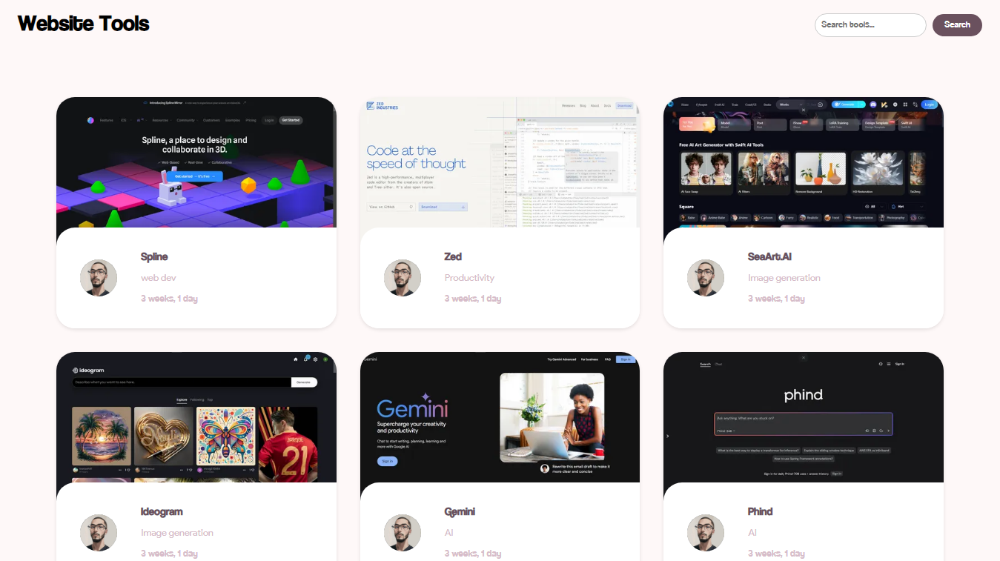

# Toolkit API Web App

Welcome to Toolkit API, a web application designed for sharing various websites that serve as usable tools, ranging from AI tools to uploading tools and more!

🚀 **Features:**
- Share and discover a wide range of useful websites and tools.
- Explore AI tools, uploading tools, and more.
- Built-in search functionality to easily find what you're looking for.

🔧 **Technologies Used:**
- Django
- HTML
- JavaScript
- CSS

🛠️ **Installation:**
1. Clone this repository to your local machine.
2. Navigate to the project directory.
3. Install the necessary dependencies using `pipenv install`.( recommended Pipenv : ``pip install --user pipenv``)
4. Run the server using `python manage.py runserver`.

🌐 **Usage:**
1. Register for an admin account or log in if you already have one.
2. Explore the various tools and websites shared by the community.
3. Submit your own tools or websites to share with others.

📝 **Preview:**

📝 **Contributing:**
Contributions are welcome! If you have suggestions for new features, improvements, or bug fixes, please submit a pull request.

📧 **Contact:**
For any inquiries or support, feel free to contact us at [ahmedkeloch@gmail.com](mailto:ahmedkeloch@gmail.com).

📄 **License:**
This project is licensed under the [MIT License](https://opensource.org/licenses/MIT). See the [LICENSE](LICENSE) file for more details.